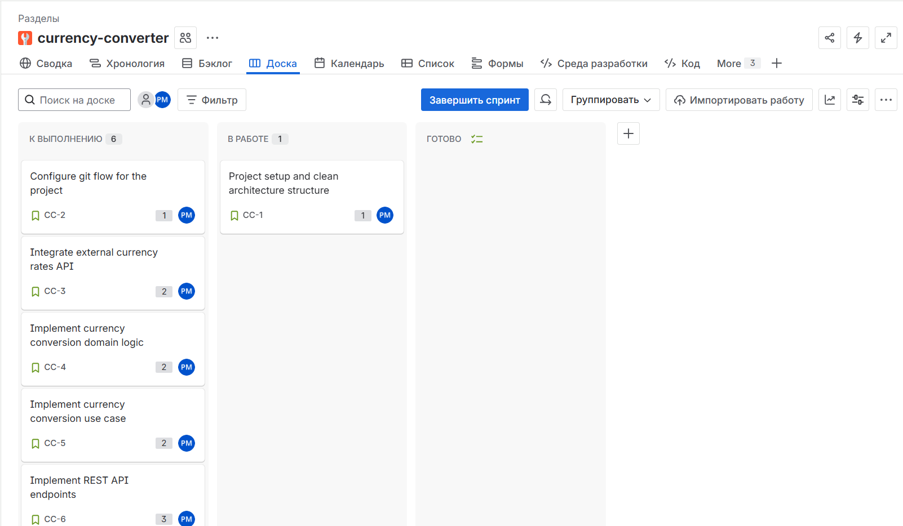
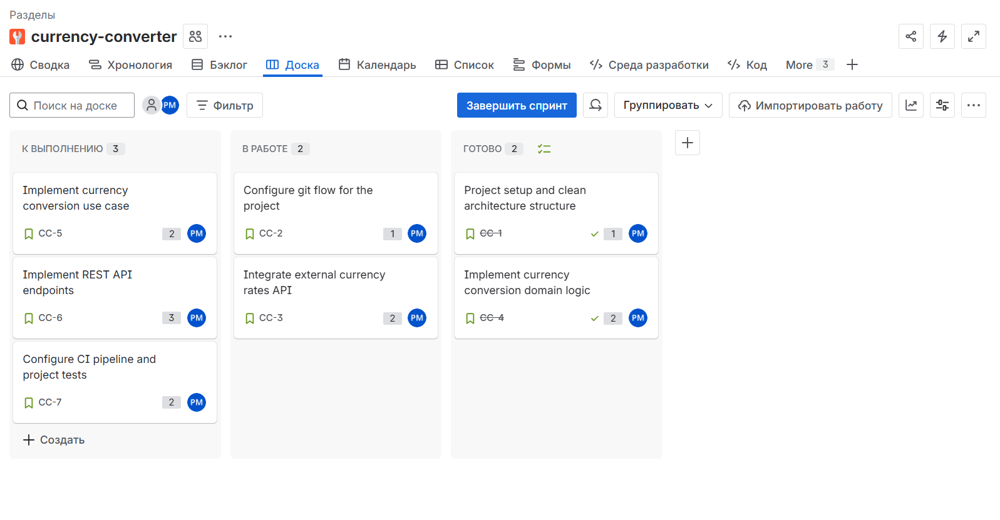
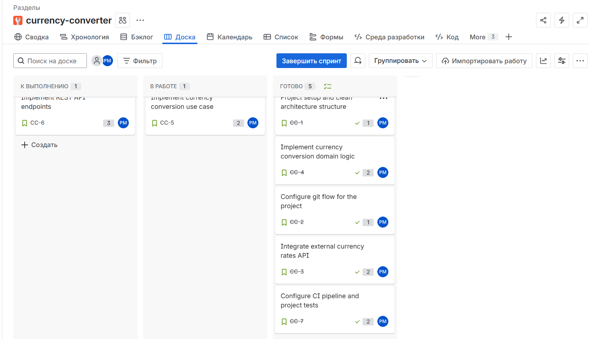
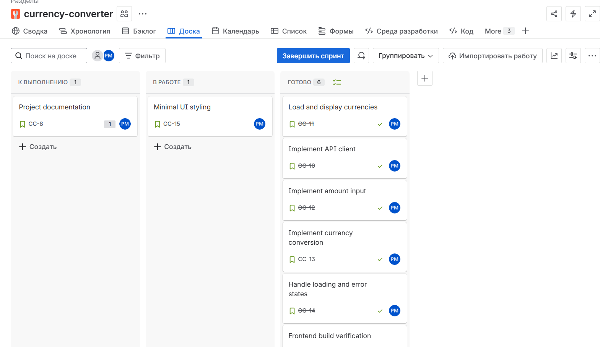

# Currency Converter

Full-stack учебный проект: конвертер валют с backend на FastAPI и frontend на Vite.
Backend берёт список валют и курсы из внешнего сервиса (Frankfurter API), фронт позволяет выбрать валюты, ввести сумму и получить результат конвертации.

## Features
- Получение доступных валют: `GET /currencies`
- Конвертация: `POST /convert`
- Отображение результата на UI
- Базовая клиентская валидация суммы (кнопка Convert отключается при `amount <= 0`)
- CI: backend (ruff + pytest), frontend (npm ci + build, тесты если есть)

## Tech Stack
**Backend:** FastAPI, httpx, Pydantic  
**Frontend:** Vite, Vanilla JS, HTML/CSS  
**CI:** GitHub Actions

## Структура проекта
```
src/
  currency_converter/              # Backend-приложение
    main.py                         # Точка входа: создание FastAPI, подключение роутов и CORS
    config.py                       # Конфигурация через env-переменные (URL API, таймауты, CORS)
    domain/                         # Доменный слой (чистая бизнес-логика)
      models.py                     # Доменные сущности: Currency, Money
      services.py                   # Доменные операции: конвертация Money по курсу
    application/                    # Прикладной слой (use cases, orchestration)
      ports.py                      # Порт-абстракция провайдера курсов (RatesProvider)
      use_cases.py                  # Сценарии: ConvertCurrencyUseCase + команды/результаты
      exceptions.py                 # Ошибки прикладного уровня (преобразуются из инфраструктурных)
    infrastructure/                 # Инфраструктура (интеграции/адаптеры)
      frankfurter_client.py         # HTTP-клиент Frankfurter API
      rates_provider.py             # Адаптер RatesProvider поверх клиента
      exceptions.py                 # Ошибки внешнего сервиса
    presentation/                   # Внешний слой (API/ввод-вывод)
      api.py                        # FastAPI-роуты: /currencies, /convert
      schemas.py                    # Pydantic-схемы запросов/ответов
      dependencies.py               # DI-провайдеры зависимостей (rates provider)

frontend/                           # Веб-интерфейс (Vite)
  src/                              # UI-логика: выбор валют, ввод суммы, показ результата

tests/                              # Тесты backend-логики
docs/                               # Документация и изображения (скриншоты Jira)
```

### Как это работает (с точки зрения бизнес‑логики)
1. **Presentation** принимает HTTP‑запросы, валидирует входные данные (Pydantic) и вызывает use case.
2. **Application** содержит сценарии (use cases), собирает доменные объекты и запрашивает курсы через порт.
3. **Domain** описывает сущности и чистую бизнес‑операцию конвертации, не зависящую от транспорта.
4. **Infrastructure** реализует порт получения курсов через Frankfurter API.

---

## API

### `GET /currencies`
Возвращает словарь код -> название валюты.

Пример ответа:
```json
{
  "currencies": {
    "USD": "United States Dollar",
    "EUR": "Euro"
  }
}
```
### `POST /convert`
Пример запроса:
```json
{
  "amount": 1,
  "from_currency": "USD",
  "to_currency": "EUR"
}
```
Пример ответа:
```json
{
  "amount": 1,
  "from_currency": "USD",
  "to_currency": "EUR",
  "rate": 0.85896,
  "result": 0.85896
}
```
---

### Ход разработки в Jira:




